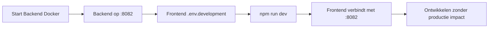

# Frontend Connectie - Samenvatting

## 🎯 Overzicht

Deze backend API draait op twee locaties:

| Omgeving | URL | Database | Status |
|----------|-----|----------|--------|
| **Lokaal** | `http://localhost:8082` | Docker PostgreSQL (poort 5433) | ✅ Draait nu |
| **Productie** | `https://dklemailservice.onrender.com` | Render PostgreSQL | ✅ Actief |

## 🚀 Voor Frontend Developers

### Lokale Development

**1. Backend is al gestart:**
```bash
# Check status
docker-compose -f docker-compose.dev.yml ps
# Alle services draaien: ✅
```

**2. In je FRONTEND project, maak `.env.development`:**
```env
VITE_API_BASE_URL=http://localhost:8082/api
```

**3. Start je frontend:**
```bash
npm run dev
```

**Klaar!** Frontend verbindt nu met lokale backend op `localhost:8082`

### Productie Build

**Maak `.env.production` in je frontend:**
```env
VITE_API_BASE_URL=https://dklemailservice.onrender.com/api
```

```bash
npm run build
```

## 📁 Bestanden voor Frontend Team

| Bestand | Doel |
|---------|------|
| [`FRONTEND_LOCAL_DEVELOPMENT.md`](./FRONTEND_LOCAL_DEVELOPMENT.md) | Complete development guide |
| [`FRONTEND_SETUP_QUICK.md`](./FRONTEND_SETUP_QUICK.md) | Quick start (3 stappen) |
| [`FRONTEND_API_REFERENCE.md`](./FRONTEND_API_REFERENCE.md) | API endpoints documentatie |
| [`frontend-env-example.txt`](./frontend-env-example.txt) | Environment variabelen voorbeeld |
| [`frontend-api-client-example.ts`](./frontend-api-client-example.ts) | Ready-to-use API client code |

## 🔑 Belangrijkste Info

### API Base URLs
```typescript
const API_URLS = {
  development: 'http://localhost:8082/api',
  production: 'https://dklemailservice.onrender.com/api'
};
```

### CORS - Al Geconfigureerd ✅
Backend accepteert requests van:
- `http://localhost:3000` (React/Next.js default)
- `http://localhost:5173` (Vite default)
- `https://admin.dekoninklijkeloop.nl` (Productie admin)
- `https://www.dekoninklijkeloop.nl` (Productie website)

### Authenticatie
```typescript
// Login
POST /api/auth/login
Body: { email, password }
Response: { token, refresh_token, user }

// Gebruik token in requests
Headers: { Authorization: 'Bearer <token>' }
```

### Populaire Admin Endpoints
```
GET  /api/contact              - Contactformulieren lijst
GET  /api/aanmelding           - Aanmeldingen lijst
GET  /api/users                - Gebruikers lijst
GET  /api/albums/admin         - Albums beheer
GET  /api/photos/admin         - Foto's beheer
POST /api/steps/:id            - Steps updaten (NIEUW!)
GET  /api/total-steps          - Totaal steps (NIEUW!)
```

## 🔄 Development Workflow



### Dagelijkse Workflow

**Ochtend:**
```bash
# In backend directory
docker-compose -f docker-compose.dev.yml up -d

# In frontend directory  
npm run dev
```

**Einde dag:**
```bash
# Backend (optioneel - kan blijven draaien)
docker-compose -f docker-compose.dev.yml down
```

## ✨ Nieuwe Features in Deze Update

### 1. Steps Tracking API
Deelnemers kunnen hun gelopen stappen bijhouden:
```typescript
// Update steps
POST /api/steps/{participant_id}
Body: { "steps": 10000 }

// Dashboard data
GET /api/participant/{id}/dashboard

// Totalen
GET /api/total-steps
GET /api/funds-distribution
```

### 2. Route Funds
Nieuw model voor fondsen verdeling per route.

### 3. Database Performance
Nieuwe optimalisaties:
- Geautomatiseerde `updated_at` timestamps
- Materialized views voor dashboard stats
- Verbeterde indexen

## 🐛 Troubleshooting

### CORS Error?
```javascript
// Check origin in console
console.log(window.location.origin);
// Moet zijn: http://localhost:3000 of :5173
```

### 401 Unauthorized?
```javascript
// Check token
console.log(localStorage.getItem('auth_token'));
// Moet een JWT string zijn
```

### Connection Refused?
```bash
# Check backend status
docker-compose -f docker-compose.dev.yml ps
# App moet "Up" status hebben
```

## 📞 Hulp Nodig?

1. **Backend Issues**: Check [`FRONTEND_LOCAL_DEVELOPMENT.md`](./FRONTEND_LOCAL_DEVELOPMENT.md)
2. **API Vragen**: Check [`FRONTEND_API_REFERENCE.md`](./FRONTEND_API_REFERENCE.md)
3. **Quick Setup**: Check [`FRONTEND_SETUP_QUICK.md`](./FRONTEND_SETUP_QUICK.md)

## ✅ Status Check Commands

**Backend gestart?**
```bash
curl http://localhost:8082/api/health
```

**Services healthy?**
```bash
docker-compose -f docker-compose.dev.yml ps
```

**Logs bekijken?**
```bash
docker-compose -f docker-compose.dev.yml logs -f app
```

---

**Backend Team:** DKL Development  
**Laatste Update:** November 2025  
**Backend Versie:** 1.1.0  
**Productie URL:** https://dklemailservice.onrender.com