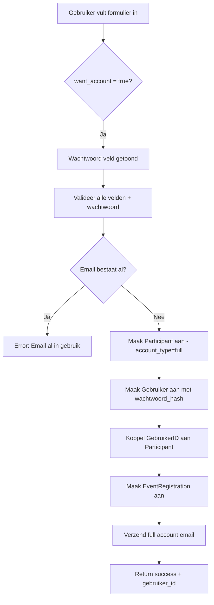
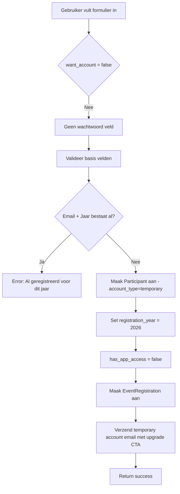
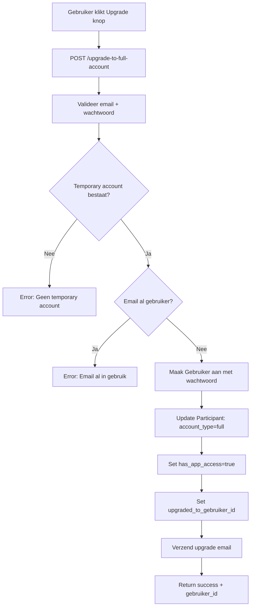

# V30: Duaal Registratiesysteem - Implementatie Documentatie

**Datum:** 2025-11-10
**Versie:** 30
**Status:** ✅ Geïmplementeerd & Geverifieerd

## 📋 Overzicht

Het duale registratiesysteem biedt gebruikers de keuze tussen twee registratiepaden:

1. **Full Account** (Volledig Account)
   - ✅ Volledige toegang tot DKL Step App
   - ✅ Wachtwoord-beschermd account
   - ✅ Permanente account voor alle toekomstige events
   - ✅ Tracking van stappen, badges, achievements via app
   
2. **Temporary Registration** (Tijdelijke Registratie)
   - ✅ Registratie geldig voor huidige evenementjaar (2026)
   - ❌ Geen DKL Step App toegang
   - ❌ Geen wachtwoord vereist
   - ✅ Kan later geüpgraded worden naar Full Account

## 🗃️ DATABASE ARCHITECTUUR - Duidelijke Scheiding

### 3 Belangrijkste Tables bij Registratie

#### 1️⃣ `participants` - DE PERSOON
**Functie:** Wie is deze persoon? Welk type account?

**Wat staat HIER:**
- Persoonsgegevens: `naam`, `email`, `telefoon`
- Account type: `account_type` (full/temporary)
- Account credentials: `wachtwoord_hash` (alleen full accounts)
- App toegang: `has_app_access` (true/false)
- RBAC koppeling: `gebruiker_id`

**Wat staat NIET hier:**
- ❌ GEEN `rol` (staat in event_registrations)
- ❌ GEEN `afstand` (staat in event_registrations)
- ❌ GEEN `ondersteuning` (staat in event_registrations)
- ❌ GEEN `bijzonderheden` (staat in event_registrations)
- ❌ GEEN `steps` (staat in event_registrations)

**Waarom niet?** Een persoon kan bij meerdere events deelnemen met verschillende rollen/afstanden!

#### 2️⃣ `event_registrations` - DE DEELNAME
**Functie:** HOE neemt deze persoon deel aan een specifiek event?

**Wat staat HIER:**
- Event koppeling: `event_id`, `participant_id`
- **Event-specifieke keuzes:**
  - ✅ `participant_role_name` - ROL (Deelnemer/Begeleider/Vrijwilliger)
  - ✅ `distance_route` - AFSTAND (2.5KM/6KM/10KM/15KM)
  - ✅ `ondersteuning` - ONDERSTEUNING (Ja/Nee/Anders)
  - ✅ `bijzonderheden` - Extra info
- **STAPPEN TRACKING:**
  - ✅ `steps` - Real-time stappen count (via WebSocket)
  - ✅ `total_distance` - Afgelegde afstand
  - ✅ `last_location_update` - Laatste GPS update
- Status tracking: `status`, `tracking_status`
- Timestamps: `registered_at`, `check_in_time`, `start_time`, `finish_time`

**Voorbeeld:** Jeffrey heeft 2 event_registrations:
```
DKL 2026: rol="Deelnemer", afstand="2.5KM", steps=50000
DKL 2027: rol="Begeleider", afstand="10KM", steps=75000
```

#### 3️⃣ `gebruikers` - APP LOGIN
**Functie:** Login credentials voor de DKL Step App (alleen full accounts!)

**Wat staat HIER:**
- Login gegevens: `email`, `wachtwoord_hash`
- Basis info: `naam`, `is_actief`
- Laatste login: `laatste_login`

**Wanneer aangemaakt?**
- ✅ Bij registratie met `want_account = true`
- ❌ NIET bij temporary accounts

## 👟 STAPPEN TRACKING - Belangrijke Uitleg

### Waar worden stappen opgeslagen?

**In [`event_registrations.steps`](../models/event_registration.go:25) kolom!**

**Waarom daar?**
Stappen zijn **event-specifiek**. Jeffrey's stappen:
- DKL 2026 event → 50.000 stappen (event_registrations record 1)
- DKL 2027 event → 75.000 stappen (event_registrations record 2)

### Hoe werkt de app update?

**Via WebSocket `/api/ws/steps`:**
```javascript
// App stuurt:
{
  "participant_id": "jeffrey-id",
  "steps": 50000
}

// Backend update:
UPDATE event_registrations
SET steps = 50000,
    last_location_update = NOW()
WHERE participant_id = 'jeffrey-id'
  AND event_id = '<actief_event_id>';
```

### Leaderboard Query:

```sql
-- Top 10 voor DKL 2026:
SELECT
  p.naam,
  er.steps,
  er.distance_route,
  er.participant_role_name
FROM event_registrations er
JOIN participants p ON p.id = er.participant_id
WHERE er.event_id = 'dkl-2026'
ORDER BY er.steps DESC
LIMIT 10;
```

## 🗃️ Database Wijzigingen

### Nieuwe Kolommen in `participants` Tabel

```sql
-- Account type: 'full' of 'temporary'
account_type TEXT NOT NULL DEFAULT 'temporary'

-- Jaar van registratie (voor temporary accounts)
registration_year INTEGER

-- Wachtwoord hash (alleen voor full accounts)
wachtwoord_hash TEXT

-- Expliciete app toegang flag
has_app_access BOOLEAN NOT NULL DEFAULT FALSE

-- Upgrade tracking
upgraded_to_gebruiker_id UUID REFERENCES gebruikers(id)
upgraded_at TIMESTAMPTZ
```

### Nieuwe Tabel: `participant_upgrades`

Audit trail voor upgrades van temporary naar full accounts.

```sql
CREATE TABLE participant_upgrades (
    id UUID PRIMARY KEY,
    participant_id UUID NOT NULL REFERENCES participants(id),
    gebruiker_id UUID NOT NULL REFERENCES gebruikers(id),
    upgraded_at TIMESTAMPTZ NOT NULL,
    upgraded_by UUID REFERENCES gebruikers(id),
    notes TEXT
);
```

### Constraints & Indexes

```sql
-- Unieke constraint: 1 temporary registratie per email per jaar
CREATE UNIQUE INDEX idx_participants_temp_year_unique 
ON participants(email, registration_year) 
WHERE account_type = 'temporary';

-- Performance indexes
CREATE INDEX idx_participants_account_type ON participants(account_type);
CREATE INDEX idx_participants_registration_year ON participants(registration_year);
CREATE INDEX idx_participants_has_app_access ON participants(has_app_access);
```

## 🔧 Backend Implementatie

### Nieuwe Models

#### `AccountType` Enum
```go
type AccountType string

const (
    AccountTypeFull      AccountType = "full"      
    AccountTypeTemporary AccountType = "temporary" 
)
```

#### `PublicRegistrationRequest` DTO
```go
type PublicRegistrationRequest struct {
    // Basis gegevens
    Naam     string `json:"naam" binding:"required"`
    Email    string `json:"email" binding:"required,email"`
    Telefoon string `json:"telefoon"` // Verplicht voor Begeleider/Vrijwilliger
    
    // Event keuzes
    Rol            string `json:"rol" binding:"required"`
    Afstand        string `json:"afstand" binding:"required"`
    Ondersteuning  string `json:"ondersteuning" binding:"required"`
    Bijzonderheden string `json:"bijzonderheden"`
    
    // Account keuze - NIEUW in V30
    WantAccount bool    `json:"want_account"` // true = full, false = temporary
    Wachtwoord  *string `json:"wachtwoord"`   // Verplicht als want_account = true
    
    // Voorwaarden
    Terms bool `json:"terms" binding:"required"`
    
    // Optioneel
    EventID  *string `json:"event_id"`
    TestMode bool    `json:"test_mode"`
}
```

### API Endpoints

#### 1. Publieke Registratie
```
POST /api/public/aanmelden
Content-Type: application/json

Request Body:
{
  "naam": "Jan Jansen",
  "email": "jan@example.com",
  "telefoon": "06-12345678",  // Optioneel (verplicht voor Begeleider/Vrijwilliger)
  "rol": "Deelnemer",         // Deelnemer|Begeleider|Vrijwilliger
  "afstand": "10 KM",         // 2.5 KM|6 KM|10 KM|15 KM
  "ondersteuning": "Nee",     // Ja|Nee|Anders
  "bijzonderheden": "",       // Verplicht als ondersteuning = Ja|Anders
  "want_account": true,       // true = full account, false = temporary
  "wachtwoord": "geheim123",  // Verplicht als want_account = true
  "terms": true,
  "test_mode": false
}

Response (201 Created):
{
  "success": true,
  "message": "Je bent succesvol ingeschreven...",
  "participant_id": "uuid",
  "registration_id": "uuid",
  "account_type": "full",     // of "temporary"
  "has_app_access": true,     // of false
  "gebruiker_id": "uuid",     // alleen voor full accounts
  "event_name": "De Koninklijke Loop 2026",
  "event_date": "16-05-2026"
}
```

#### 2. Upgrade naar Full Account
```
POST /api/public/upgrade-to-full-account
Content-Type: application/json

Request Body:
{
  "email": "jan@example.com",
  "wachtwoord": "nieuw_wachtwoord123"  // min 8 karakters
}

Response (200 OK):
{
  "success": true,
  "message": "Je account is geüpgraded!",
  "gebruiker_id": "uuid",
  "participant_id": "uuid",
  "has_app_access": true
}
```

#### 3. Haal Actief Event Op
```
GET /api/public/events/active

Response (200 OK):
{
  "id": "550e8400-e29b-41d4-a716-446655440000",
  "name": "De Koninklijke Loop 2026",
  "description": "...",
  "start_time": "2026-05-16T09:00:00Z",
  "status": "upcoming"
}
```

## 📧 Email Templates

### 1. Full Account Bevestiging
**Template:** `templates/registration_full_account_email.html`
- Welkomstbericht met account details
- App download links
- Inloggegevens
- Event informatie

### 2. Temporary Registration Bevestiging
**Template:** `templates/registration_temporary_account_email.html`
- Registratie bevestiging
- Event informatie
- **Upgrade CTA** - Nodigt uit om te upgraden naar full account
- Beperkte functionaliteit uitleg

### 3. Account Upgrade Bevestiging
**Template:** `templates/account_upgrade_email.html`
- Upgrade bevestiging
- App download links
- Nieuwe mogelijkheden
- Inloggegevens

## 🔐 Validatie Regels

### Algemene Validatie (beide paden)
- ✅ Naam verplicht
- ✅ Email verplicht & valid format
- ✅ Rol verplicht (Deelnemer|Begeleider|Vrijwilliger)
- ✅ Afstand verplicht (2.5 KM|6 KM|10 KM|15 KM)
- ✅ Ondersteuning verplicht (Ja|Nee|Anders)
- ✅ Bijzonderheden verplicht als ondersteuning = Ja|Anders
- ✅ Terms = true verplicht

### Rol-Specifieke Validatie
- ✅ Telefoon verplicht voor Begeleider & Vrijwilliger
- ✅ Telefoon optioneel voor Deelnemer

### Full Account Specifieke Validatie
- ✅ Wachtwoord verplicht als `want_account = true`
- ✅ Wachtwoord minimaal 8 karakters
- ✅ Email mag niet al bestaan als gebruiker

### Temporary Account Specifieke Validatie
- ✅ Email mag niet al geregistreerd zijn voor hetzelfde jaar
- ✅ Geen wachtwoord vereist

### Upgrade Validatie
- ✅ Email moet bestaan als temporary account
- ✅ Email mag niet al bestaan als full account
- ✅ Wachtwoord minimaal 8 karakters

## 🔄 Registratie Flow

### Flow 1: Full Account Registratie



### Flow 2: Temporary Account Registratie



### Flow 3: Upgrade naar Full Account



## 🎨 Frontend Wijzigingen

### Benodigde Aanpassingen aan FormContainer.tsx

#### 1. Nieuwe State voor Account Keuze
```typescript
const [wantAccount, setWantAccount] = useState<boolean | null>(null);
const [showPasswordField, setShowPasswordField] = useState(false);
```

#### 2. Nieuwe Sectie: Account Type Keuze
```tsx
{/* Account Type Keuze - NIEUW */}
<section className="space-y-6" aria-labelledby="account-type-heading">
  <h2 id="account-type-heading" className={cn(cc.text.h2, 'text-gray-900 pb-4')}>
    Wil je een account aanmaken?
  </h2>
  
  <div className="grid grid-cols-1 md:grid-cols-2 gap-4">
    {/* Full Account Optie */}
    <label className="relative cursor-pointer">
      <input
        type="radio"
        name="account_choice"
        value="full"
        className="peer sr-only"
        onChange={() => {
          setWantAccount(true);
          setShowPasswordField(true);
          setValue('want_account', true);
        }}
      />
      <div className="p-6 rounded-xl border-2 border-gray-200 bg-white
        peer-checked:border-primary peer-checked:bg-primary/5">
        <span className="text-4xl mb-3">📱</span>
        <h3 className="font-semibold text-lg mb-2">Ja, maak een account aan</h3>
        <ul className="text-sm text-gray-600 space-y-1">
          <li>✅ Toegang tot DKL Step App</li>
          <li>✅ Stappen tracking</li>
          <li>✅ Badges & achievements</li>
          <li>✅ Community features</li>
        </ul>
      </div>
    </label>

    {/* Temporary Registratie Optie */}
    <label className="relative cursor-pointer">
      <input
        type="radio"
        name="account_choice"
        value="temporary"
        className="peer sr-only"
        onChange={() => {
          setWantAccount(false);
          setShowPasswordField(false);
          setValue('want_account', false);
          setValue('wachtwoord', undefined);
        }}
      />
      <div className="p-6 rounded-xl border-2 border-gray-200 bg-white
        peer-checked:border-primary peer-checked:bg-primary/5">
        <span className="text-4xl mb-3">📝</span>
        <h3 className="font-semibold text-lg mb-2">Nee, alleen registreren</h3>
        <ul className="text-sm text-gray-600 space-y-1">
          <li>✅ Registratie voor 2026</li>
          <li>✅ Geen account nodig</li>
          <li>⚠️ Geen app toegang</li>
          <li>💡 Later upgraden mogelijk</li>
        </ul>
      </div>
    </label>
  </div>
</section>
```

#### 3. Conditioneel Wachtwoord Veld
```tsx
{/* Wachtwoord sectie - alleen voor full accounts */}
{showPasswordField && (
  <section className="space-y-6 transition-all" aria-labelledby="password-heading">
    <h2 id="password-heading" className={cn(cc.text.h2, 'text-gray-900 pb-4')}>
      Kies je wachtwoord
    </h2>
    <div className="space-y-2">
      <label htmlFor="wachtwoord" className={cc.form.label}>
        Wachtwoord (minimaal 8 karakters)
      </label>
      <input
        type="password"
        id="wachtwoord"
        className={cn(
          'w-full px-4 py-3 rounded-xl border-2',
          'focus:outline-none focus:ring-2 focus:ring-primary/20',
          errors.wachtwoord ? 'border-red-500' : 'border-gray-200 focus:border-primary'
        )}
        placeholder="••••••••"
        {...register('wachtwoord', { 
          required: wantAccount ? 'Wachtwoord is verplicht voor een volledig account' : false,
          minLength: wantAccount ? { value: 8, message: 'Wachtwoord moet minimaal 8 karakters zijn' } : undefined
        })}
      />
      {errors.wachtwoord && (
        <p className={cn(cc.form.errorMessage)}>{errors.wachtwoord.message}</p>
      )}
      
      <div className="bg-blue-50 border border-blue-200 rounded-lg p-3 mt-2">
        <p className="text-sm text-blue-900">
          💡 Je gebruikt dit wachtwoord om in te loggen in de DKL Step App
        </p>
      </div>
    </div>
  </section>
)}
```

#### 4. Update Schema Validatie
```typescript
// schema.ts
export const RegistrationSchema = z.object({
  naam: z.string().min(1, 'Naam is verplicht'),
  email: z.string().email('Ongeldig e-mailadres'),
  telefoon: z.string().optional(),
  rol: z.enum(['Deelnemer', 'Begeleider', 'Vrijwilliger'], {
    errorMap: () => ({ message: 'Selecteer een rol' })
  }),
  afstand: z.enum(['2.5 KM', '6 KM', '10 KM', '15 KM'], {
    errorMap: () => ({ message: 'Selecteer een afstand' })
  }),
  ondersteuning: z.enum(['Ja', 'Nee', 'Anders'], {
    errorMap: () => ({ message: 'Geef aan of je ondersteuning nodig hebt' })
  }),
  bijzonderheden: z.string().optional(),
  terms: z.boolean().refine(val => val === true, {
    message: 'Je moet akkoord gaan met de voorwaarden'
  }),
  
  // V30: Nieuwe velden
  want_account: z.boolean(),
  wachtwoord: z.string().min(8, 'Wachtwoord moet minimaal 8 karakters zijn').optional(),
  
  test_mode: z.boolean().optional()
}).refine(
  // Custom validatie: Als want_account = true, dan wachtwoord verplicht
  (data) => !data.want_account || (data.wachtwoord && data.wachtwoord.length >= 8),
  {
    message: "Wachtwoord is verplicht voor een volledig account",
    path: ["wachtwoord"]
  }
).refine(
  // Custom validatie: Telefoon verplicht voor Begeleider/Vrijwilliger
  (data) => {
    if (data.rol === 'Begeleider' || data.rol === 'Vrijwilliger') {
      return data.telefoon && data.telefoon.length > 0;
    }
    return true;
  },
  {
    message: "Telefoonnummer is verplicht voor begeleiders en vrijwilligers",
    path: ["telefoon"]
  }
).refine(
  // Custom validatie: Bijzonderheden verplicht als ondersteuning Ja/Anders
  (data) => {
    if (data.ondersteuning === 'Ja' || data.ondersteuning === 'Anders') {
      return data.bijzonderheden && data.bijzonderheden.length > 0;
    }
    return true;
  },
  {
    message: "Bijzonderheden zijn verplicht als je ondersteuning nodig hebt",
    path: ["bijzonderheden"]
  }
);
```

#### 5. Update API Call
```typescript
// In onSubmit functie
const onSubmit = async (data: RegistrationFormData) => {
  try {
    setIsSubmitting(true);
    setSubmitError(null);
    
    const validatedData = validateForm(data);
    
    // Stuur naar NIEUWE publieke endpoint
    const response = await apiClient.post('/api/public/aanmelden', {
      naam: validatedData.naam,
      email: validatedData.email,
      telefoon: validatedData.telefoon,
      rol: validatedData.rol,
      afstand: validatedData.afstand,
      ondersteuning: validatedData.ondersteuning,
      bijzonderheden: validatedData.bijzonderheden,
      want_account: validatedData.want_account,
      wachtwoord: validatedData.wachtwoord,
      terms: validatedData.terms,
      test_mode: false
    });
    
    // Response bevat account_type, has_app_access, etc.
    logEvent('registration', 'registration_complete', 
      `${validatedData.rol}_${validatedData.afstand}_${response.account_type}`);
    
    onSuccess(validatedData);
  } catch (error) {
    // Error handling...
  }
};
```

### Upgrade Flow (Aparte pagina/component)

```typescript
// UpgradeAccount.tsx
const UpgradeAccountPage: React.FC = () => {
  const [email, setEmail] = useState('');
  const [password, setPassword] = useState('');
  const [isSubmitting, setIsSubmitting] = useState(false);

  const handleUpgrade = async (e: React.FormEvent) => {
    e.preventDefault();
    
    try {
      setIsSubmitting(true);
      
      const response = await apiClient.post('/api/public/upgrade-to-full-account', {
        email,
        wachtwoord: password
      });
      
      if (response.success) {
        toast.success('Je account is geüpgraded! Je kunt nu inloggen in de app.');
        // Redirect naar app download of login
      }
    } catch (error) {
      const axiosError = error as { response?: { data?: { error?: string, code?: string } } };
      
      if (axiosError?.response?.data?.code === 'NO_TEMPORARY_ACCOUNT') {
        toast.error('Geen tijdelijke registratie gevonden met dit e-mailadres.');
      } else if (axiosError?.response?.data?.code === 'ALREADY_FULL_ACCOUNT') {
        toast.error('Dit account is al een volledig account.');
      } else if (axiosError?.response?.data?.code === 'EMAIL_EXISTS') {
        toast.error('Er bestaat al een volledig account met dit e-mailadres.');
      } else {
        toast.error('Upgrade mislukt. Probeer het later opnieuw.');
      }
    } finally {
      setIsSubmitting(false);
    }
  };

  return (
    <form onSubmit={handleUpgrade}>
      {/* Upgrade form UI */}
    </form>
  );
};
```

## 🧪 Testing

### Test Scenarios

#### Scenario 1: Full Account Registratie
```bash
curl -X POST http://localhost:8080/api/public/aanmelden \
  -H "Content-Type: application/json" \
  -d '{
    "naam": "Test Gebruiker",
    "email": "test@example.com",
    "rol": "Deelnemer",
    "afstand": "10 KM",
    "ondersteuning": "Nee",
    "want_account": true,
    "wachtwoord": "testpass123",
    "terms": true
  }'
```

**Verwacht resultaat:**
- Status: 201 Created
- Response bevat `gebruiker_id`
- `account_type`: "full"
- `has_app_access`: true
- Email verzonden naar test@example.com

#### Scenario 2: Temporary Registratie
```bash
curl -X POST http://localhost:8080/api/public/aanmelden \
  -H "Content-Type: application/json" \
  -d '{
    "naam": "Temp Gebruiker",
    "email": "temp@example.com",
    "rol": "Deelnemer",
    "afstand": "6 KM",
    "ondersteuning": "Nee",
    "want_account": false,
    "terms": true
  }'
```

**Verwacht resultaat:**
- Status: 201 Created
- Geen `gebruiker_id`
- `account_type`: "temporary"
- `has_app_access`: false
- Email met upgrade CTA

#### Scenario 3: Upgrade
```bash
curl -X POST http://localhost:8080/api/public/upgrade-to-full-account \
  -H "Content-Type: application/json" \
  -d '{
    "email": "temp@example.com",
    "wachtwoord": "newpass123"
  }'
```

**Verwacht resultaat:**
- Status: 200 OK
- Response bevat `gebruiker_id`
- `has_app_access`: true
- Upgrade email verzonden

### Edge Cases

1. **Dubbele registratie (temporary, zelfde jaar)**
   - Error: 409 Conflict
   - Code: "ALREADY_REGISTERED"

2. **Dubbele registratie (full account)**
   - Error: 409 Conflict  
   - Code: "EMAIL_EXISTS"

3. **Upgrade van full account**
   - Error: 400 Bad Request
   - Code: "ALREADY_FULL_ACCOUNT"

4. **Upgrade van non-existent account**
   - Error: 404 Not Found
   - Code: "NO_TEMPORARY_ACCOUNT"

5. **Telefoon ontbreekt voor Begeleider**
   - Error: 400 Bad Request
   - Code: "VALIDATION_ERROR"

6. **Bijzonderheden ontbreekt bij Ondersteuning=Ja**
   - Error: 400 Bad Request
   - Code: "VALIDATION_ERROR"

## 📊 Database Queries

### Check Account Type
```sql
SELECT account_type, has_app_access, registration_year
FROM participants
WHERE email = 'user@example.com';
```

### Find Temporary Accounts voor 2026
```sql
SELECT * FROM participants
WHERE account_type = 'temporary'
AND registration_year = 2026
ORDER BY created_at DESC;
```

### Find Upgraded Accounts
```sql
SELECT p.*, u.email as gebruiker_email
FROM participants p
LEFT JOIN gebruikers u ON p.upgraded_to_gebruiker_id = u.id
WHERE p.upgraded_to_gebruiker_id IS NOT NULL
ORDER BY p.upgraded_at DESC;
```

### Upgrade Statistics
```sql
SELECT 
  COUNT(*) FILTER (WHERE account_type = 'full') as full_accounts,
  COUNT(*) FILTER (WHERE account_type = 'temporary') as temporary_accounts,
  COUNT(*) FILTER (WHERE upgraded_to_gebruiker_id IS NOT NULL) as upgraded_accounts
FROM participants
WHERE registration_year = 2026;
```

## 🚀 Deployment Checklist

- [x] Database migratie V30 aangemaakt
- [x] Models bijgewerkt met nieuwe velden
- [x] PublicRegistrationHandler geïmplementeerd
- [x] Email templates aangemaakt
- [x] Validatie logica geïmplementeerd
- [x] Handler geregistreerd in main.go
- [ ] Repository interfaces bijgewerkt (indien nodig)
- [ ] Tests geschreven
- [ ] Frontend componenten aangepast
- [ ] API documentatie bijgewerkt
- [ ] Migratie uitgevoerd op development
- [ ] Migratie uitgevoerd op production

## 🔒 Security Overwegingen

### Rate Limiting
**TODO:** Voeg rate limiting toe aan publieke endpoints:
```go
publicApi.Post("/aanmelden", 
    RateLimitMiddleware(rateLimiter, "public_registration"),
    h.RegisterParticipant)
```

Aanbevolen limits:
- `/aanmelden`: 3 requests per 10 minuten per IP
- `/upgrade-to-full-account`: 5 requests per uur per IP

### Input Sanitization
- ✅ Email validatie via binding tags
- ✅ Wachtwoord minimumlengte (8 karakters)
- ✅ Enum validatie voor rol/afstand/ondersteuning
- ⚠️ **TODO:** HTML escaping in bijzonderheden veld

### Password Security
- ✅ Bcrypt hashing (DefaultCost = 10)
- ✅ Wachtwoord nooit in logs
- ✅ Wachtwoord nooit in JSON responses

## 📝 Migratie Uitvoeren

### Development
```bash
# Via MCP server tool
build_service --target dev
check_migrations
# Migratie wordt automatisch uitgevoerd bij startup
```

### Manual SQL
```bash
psql -h localhost -U dkl_user -d dkl_db -f database/migrations/V30__dual_registration_system.sql
```

## 🐛 Bekende Issues & Oplossingen

### Issue 1: Wachtwoord Veld Niet Getoond
**Oorzaak:** Frontend state niet correct bijgewerkt bij account keuze  
**Oplossing:** Gebruik `useEffect` om `showPasswordField` te synchroniseren met `wantAccount`

### Issue 2: Temporary Account Kan Niet Upgraden
**Oorzaak:** Email bestaat al als gebruiker  
**Oplossing:** Check wordt uitgevoerd in `UpgradeToFullAccount` handler

### Issue 3: Meerdere Temporary Accounts Per Email
**Oorzaak:** Unieke constraint alleen voor (email, year) combinatie  
**Oplossing:** Dit is correct gedrag - verschillende jaren toegestaan

## 📈 Monitoring & Metrics

### Metrics om te Tracken
- Totaal registraties per type (full vs temporary)
- Upgrade ratio (hoeveel temporary accounts upgraden?)
- Gemiddelde tijd tot upgrade
- Registraties per rol
- Registraties per afstand

### Prometheus Metrics (TODO)
```go
var (
    registrationsTotal = prometheus.NewCounterVec(
        prometheus.CounterOpts{
            Name: "dkl_registrations_total",
            Help: "Total number of registrations",
        },
        []string{"account_type", "rol", "afstand"},
    )
    
    upgradesTotal = prometheus.NewCounter(
        prometheus.CounterOpts{
            Name: "dkl_account_upgrades_total",
            Help: "Total number of account upgrades",
        },
    )
)
```

## 🔗 Gerelateerde Documentatie

- [`models/participant.go`](../models/participant.go) - Participant model met V30 velden
- [`handlers/public_registration_handler.go`](../handlers/public_registration_handler.go) - Handler implementatie
- [`database/migrations/V30__dual_registration_system.sql`](../database/migrations/V30__dual_registration_system.sql) - Database migratie
- Email Templates:
  - [`templates/registration_full_account_email.html`](../templates/registration_full_account_email.html)
  - [`templates/registration_temporary_account_email.html`](../templates/registration_temporary_account_email.html)
  - [`templates/account_upgrade_email.html`](../templates/account_upgrade_email.html)

## 🎯 Volgende Stappen

1. **Frontend Implementatie**
   - Account keuze sectie toevoegen
   - Conditioneel wachtwoord veld
   - Upgrade pagina maken
   - Success messages aanpassen per account type

2. **Rate Limiting**
   - Implementeer rate limits op publieke endpoints
   - Voorkom abuse/spam

3. **Email Verbetering**
   - Gebruik HTML templates via email service
   - Personaliseer emails verder
   - Add tracking/analytics

4. **App Integration**
   - Pas app login aan voor nieuwe gebruikers table check
   - Verificeer has_app_access vlag bij app login
   - Toon upgrade prompt in app voor temporary accounts

5. **Admin Dashboard**
   - Filter op account_type in admin panel
   - Toon upgrade statistieken
   - Bulk upgrade functionaliteit (indien nodig)

## ❓ FAQ

**Q: Kan een gebruiker meerdere temporary accounts hebben?**  
A: Ja, maar slechts 1 per jaar. Ze kunnen zich registreren voor 2026, 2027, etc.

**Q: Wat gebeurt er met oude data bij upgrade?**  
A: Alle data blijft behouden. `EventRegistrations`, `ParticipantAntwoorden`, etc. blijven gekoppeld via `participant_id`.

**Q: Kan een full account weer downgraden naar temporary?**  
A: Nee, dit is niet geïmplementeerd. Eens full, altijd full.

**Q: Wat als iemand zijn wachtwoord vergeet?**  
A: Gebruik de bestaande password reset flow via `/api/auth/reset-password` (vereist authenticatie).

**Q: Kunnen temporary accounts inloggen?**  
A: Nee, temporary accounts hebben geen `wachtwoord_hash` en `has_app_access = false`.