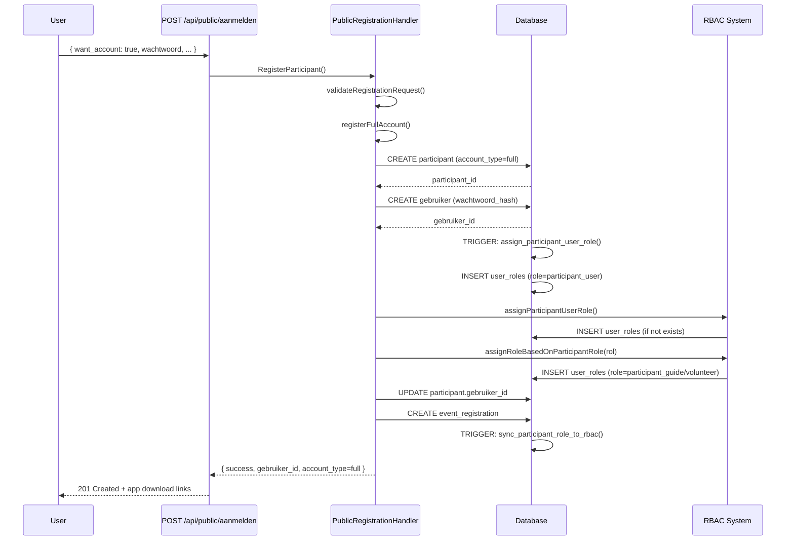
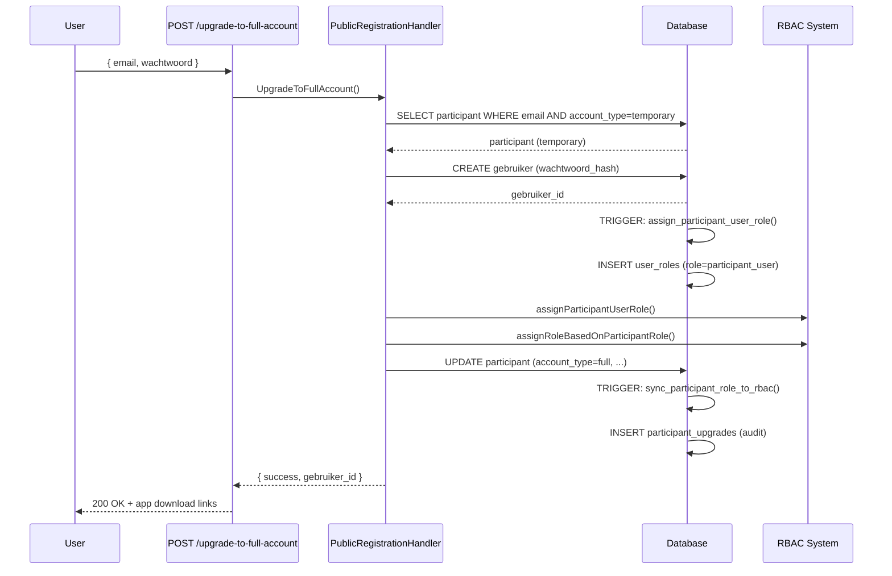
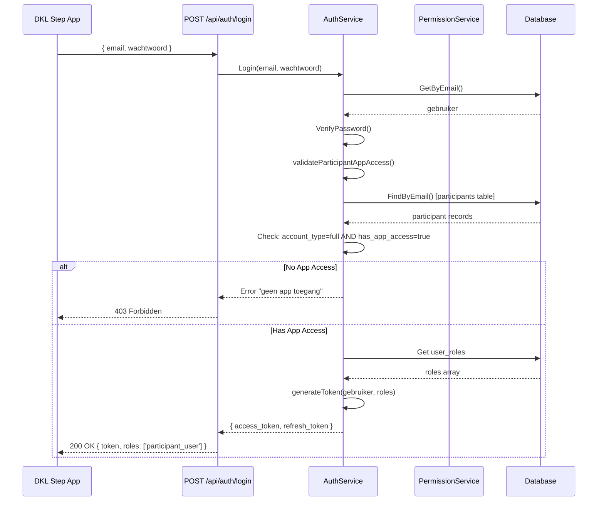

# V30 + RBAC Integratie Documentatie

**Versie:** 30  
**Datum:** 2025-11-10  
**Status:** ✅ Volledig Geïmplementeerd  
**Kritiek Systeem:** Volledige koppeling tussen V30 Duaal Registratiesysteem en RBAC

---

## 📋 Executive Summary

Deze documentatie beschrijft de **complete integratie** tussen het V30 Duale Registratiesysteem en het Role-Based Access Control (RBAC) systeem. Deze integratie zorgt ervoor dat:

1. **Full account participants** automatisch de juiste RBAC rollen krijgen
2. **App toegang** wordt afgedwongen via zowel account type als RBAC permissions
3. **Event rollen** (Deelnemer, Begeleider, Vrijwilliger) worden vertaald naar RBAC rollen
4. **Automatische rol toewijzing** gebeurt bij registratie en upgrade
5. **Permission checks** werken voor alle participant-specifieke acties

---

## 🎯 Doelstellingen

### Primaire Doelen
- ✅ **Granulaire toegangscontrole** voor participant features
- ✅ **Automatisering** van rol management
- ✅ **Consistentie** tussen account types en permissions
- ✅ **Schaalbaarheid** voor toekomstige features
- ✅ **Audit trail** voor alle permission wijzigingen

### Secundaire Doelen
- ✅ **Developer experience** - Makkelijk nieuwe permissions toevoegen
- ✅ **Security** - Defense in depth met meerdere checks
- ✅ **Performance** - Redis caching voor permission lookups
- ✅ **Maintainability** - Duidelijke scheiding tussen systeem en custom rollen

---

## 🏗️ Architectuur Overzicht

### Systeem Componenten

```
┌─────────────────────────────────────────────────────────────┐
│                    PARTICIPANT REGISTRATIE                    │
│                                                               │
│  ┌──────────────┐              ┌──────────────┐             │
│  │ Full Account │              │  Temporary   │             │
│  │ Registratie  │              │ Registratie  │             │
│  └──────┬───────┘              └──────┬───────┘             │
│         │                              │                      │
│         │                              │                      │
│         ▼                              ▼                      │
│  ┌──────────────────────────────────────────┐               │
│  │      Participant Record Created          │               │
│  │  account_type: full/temporary            │               │
│  │  has_app_access: true/false              │               │
│  └──────────────┬───────────────────────────┘               │
│                 │                                             │
└─────────────────┼─────────────────────────────────────────────┘
                  │
                  │ (Full Account Only)
                  ▼
┌─────────────────────────────────────────────────────────────┐
│                  GEBRUIKER AANGEMAAKT                         │
│                                                               │
│  ┌──────────────────────────────────────┐                   │
│  │   Gebruiker Record Created           │                   │
│  │   email, wachtwoord_hash             │                   │
│  └──────────────┬───────────────────────┘                   │
│                 │                                             │
│                 │ AUTO TRIGGER                               │
│                 ▼                                             │
│  ┌──────────────────────────────────────┐                   │
│  │  assign_participant_user_role()      │ ◄─── DATABASE     │
│  │  TRIGGER                             │      TRIGGER      │
│  └──────────────┬───────────────────────┘                   │
│                 │                                             │
└─────────────────┼─────────────────────────────────────────────┘
                  │
                  ▼
┌─────────────────────────────────────────────────────────────┐
│                  RBAC ROL TOEWIJZING                          │
│                                                               │
│  ┌──────────────────────────────────────┐                   │
│  │   user_roles Record Created          │                   │
│  │   role: participant_user             │                   │
│  └──────────────┬───────────────────────┘                   │
│                 │                                             │
│                 │ (Rol-specifiek)                            │
│                 ▼                                             │
│  ┌──────────────────────────────────────┐                   │
│  │   Optional: Extra Role               │                   │
│  │   • participant_guide (Begeleider)   │                   │
│  │   • participant_volunteer            │                   │
│  │     (Vrijwilliger)                   │                   │
│  └──────────────────────────────────────┘                   │
│                                                               │
└───────────────────────────────────────────────────────────────┘
                  │
                  ▼
┌─────────────────────────────────────────────────────────────┐
│                PERMISSIONS BESCHIKBAAR                        │
│                                                               │
│  Via: role_permissions → permissions                         │
│                                                               │
│  Participant kan nu:                                         │
│  ✓ App inloggen (app:access, app:login)                    │
│  ✓ Stappen tracken (steps:track, steps:view_own)           │
│  ✓ Achievements verdienen (achievements:earn)               │
│  ✓ Leaderboard bekijken (leaderboard:view)                 │
│  ✓ Community deelnemen (community:participate)              │
│                                                               │
└───────────────────────────────────────────────────────────────┘
```

---

## 🗃️ Database Schema

### Nieuwe RBAC Rollen (V30)

| Rol Naam | Beschrijving | Auto-Assigned | System Role |
|----------|--------------|---------------|-------------|
| `participant_user` | Basis participant met full account | ✅ Ja (bij registratie) | ✅ Ja |
| `participant_guide` | Begeleider met extra rechten | ✅ Ja (als rol = Begeleider) | ✅ Ja |
| `participant_volunteer` | Vrijwilliger met extra rechten | ✅ Ja (als rol = Vrijwilliger) | ✅ Ja |

### Nieuwe Permissions (V30)

#### Basis Participant Permissions
```sql
('participant', 'read_own', 'Eigen participant gegevens bekijken')
('participant', 'write_own', 'Eigen participant gegevens wijzigen')
('participant', 'register_event', 'Registreren voor events')
('participant', 'view_registrations', 'Eigen event registraties bekijken')
('participant', 'cancel_registration', 'Eigen registratie annuleren')
```

#### App Toegang Permissions (KRITIEK)
```sql
('app', 'access', 'Toegang tot DKL Step App')  -- VERPLICHT voor app login
('app', 'login', 'Inloggen in DKL Step App')   -- VERPLICHT voor app login
```

#### Steps & Gamification Permissions
```sql
('steps', 'track', 'Stappen bijhouden en synchroniseren')
('steps', 'view_own', 'Eigen stappen geschiedenis bekijken')
('achievements', 'view', 'Achievements bekijken')
('achievements', 'earn', 'Achievements verdienen')
('badges', 'view', 'Badges bekijken')
('badges', 'earn', 'Badges verdienen')
('leaderboard', 'view', 'Leaderboards bekijken')
('leaderboard', 'participate', 'Deelnemen aan leaderboard')
```

#### Community Permissions
```sql
('community', 'view', 'Community features bekijken')
('community', 'participate', 'Deelnemen aan community activiteiten')
```

#### Admin-Only Participant Permissions
```sql
('participant', 'read', 'Alle participants bekijken (admin)')
('participant', 'write', 'Participants bewerken (admin)')
('participant', 'delete', 'Participants verwijderen (admin)')
('participant', 'manage_upgrades', 'Account upgrades beheren (admin)')
('participant', 'view_all_registrations', 'Alle registraties bekijken (admin)')
```

### Permission Toewijzing Matrix

| Permission | participant_user | participant_guide | participant_volunteer | admin |
|-----------|------------------|-------------------|----------------------|-------|
| `app:access` | ✅ | ✅ | ✅ | ✅ |
| `app:login` | ✅ | ✅ | ✅ | ✅ |
| `steps:track` | ✅ | ✅ | ✅ | ✅ |
| `achievements:earn` | ✅ | ✅ | ✅ | ✅ |
| `community:participate` | ✅ | ✅ | ✅ | ✅ |
| `community:moderate` | ❌ | ✅ | ❌ | ✅ |
| `event:support` | ❌ | ❌ | ✅ | ✅ |
| `participant:read` | ❌ | ❌ | ❌ | ✅ |
| `participant:write` | ❌ | ❌ | ❌ | ✅ |
| `participant:delete` | ❌ | ❌ | ❌ | ✅ |

---

## 🔄 Automatische Rol Toewijzing

### Trigger 1: Nieuwe Gebruiker Aangemaakt

**Database Trigger:** `assign_participant_user_role()`

```sql
CREATE TRIGGER trigger_assign_participant_user_role
    AFTER INSERT ON gebruikers
    FOR EACH ROW
    EXECUTE FUNCTION assign_participant_user_role();
```

**Functie:**
- Wordt **automatisch** uitgevoerd bij elke nieuwe gebruiker
- Wijst `participant_user` rol toe
- Maakt `user_roles` record aan
- Gebeurt in **database** voor consistentie

**Wanneer:**
- Bij full account registratie
- Bij account upgrade van temporary naar full

### Trigger 2: Participant Account Type Update

**Database Trigger:** `sync_participant_role_to_rbac()`

```sql
CREATE TRIGGER trigger_sync_participant_role_to_rbac
    AFTER INSERT OR UPDATE OF account_type, gebruiker_id ON participants
    FOR EACH ROW
    EXECUTE FUNCTION sync_participant_role_to_rbac();
```

**Functie:**
- Synchroniseert participant **event rol** naar **RBAC rol**
- Mapping:
  - `Begeleider` → `participant_guide` rol
  - `Vrijwilliger` → `participant_volunteer` rol
  - `Deelnemer` → geen extra rol (alleen `participant_user`)

**Wanneer:**
- Bij participant update met nieuwe gebruiker_id
- Bij nieuwe full account registratie
- Bij account upgrade

### Handler Logic: Expliciete Rol Toewijzing

**Locatie:** [`handlers/public_registration_handler.go`](../handlers/public_registration_handler.go)

```go
// In registerFullAccount()
if err := h.assignParticipantUserRole(ctx, gebruiker.ID); err != nil {
    logger.Warn("Automatische rol toewijzing mislukt (trigger doet het alsnog)")
}

if err := h.assignRoleBasedOnParticipantRole(ctx, gebruiker.ID, req.Rol); err != nil {
    logger.Warn("Rol-specifieke RBAC toewijzing mislukt")
}
```

**Waarom Both Trigger EN Handler?**
- **Defense in Depth:** Dubbele zekerheid
- **Explicit Intent:** Code documenteert wat er moet gebeuren
- **Flexibility:** Handler kan extra logica toevoegen
- **Debugging:** Makkelijker om te tracken waar rol werd toegewezen

---

## 🔐 Permission Checking Flow

### Login Flow Met RBAC Checks

```
1. Gebruiker POST /api/auth/login
   │
   ├─► Email + Wachtwoord validatie
   │
   ├─► Gebruiker lookup in database
   │
   ├─► Bcrypt password verify
   │
   ├─► V30+RBAC: Participant App Access Check
   │   │
   │   ├─► Zoek participant record met gebruiker_id
   │   │
   │   ├─► Check account_type == 'full'
   │   │
   │   ├─► Check has_app_access == true
   │   │
   │   └─► FAIL? → Return "geen app toegang" error
   │
   ├─► Genereer JWT met roles array
   │   │
   │   └─► Haal user_roles op → Include in JWT claims
   │
   └─► Return access_token + refresh_token
```

### Permission Check in Protected Endpoints

```
1. Request naar beschermde endpoint (bijv. POST /api/steps/{id})
   │
   ├─► AuthMiddleware extraheert JWT
   │   │
   │   ├─► ValidateToken()
   │   │
   │   └─► Set userID in context
   │
   ├─► PermissionMiddleware (indien van toepassing)
   │   │
   │   ├─► Check s.permissionService.HasPermission(ctx, userID, "steps", "track")
   │   │   │
   │   │   ├─► Redis cache lookup
   │   │   │   └─► Hit? Return cached result
   │   │   │
   │   │   ├─► Database query via user_permissions view
   │   │   │
   │   │   └─► Cache result in Redis (5 min TTL)
   │   │
   │   └─► FAIL? → 403 Forbidden
   │
   └─► Handler executes
```

---

## 🚀 Implementatie Details

### 1. Database Migratie (V30)

**Bestand:** [`database/migrations/V30__dual_registration_system_with_rbac.sql`](../database/migrations/V30__dual_registration_system_with_rbac.sql)

**Belangrijkste Wijzigingen:**
1. Nieuwe kolommen in `participants` tabel
2. Nieuwe `participant_upgrades` audit tabel
3. **23 nieuwe permissions** voor participant features
4. **3 nieuwe RBAC rollen** (participant_user, participant_guide, participant_volunteer)
5. **2 database triggers** voor automatische rol toewijzing
6. **3 helper functies** voor permission checks
7. **2 views** voor reporting (participant_user_permissions, participant_account_stats)
8. **1 audit tabel** (participant_rbac_audit)

**Uitvoeren:**
```bash
# Automatisch bij startup via migration manager
go run main.go

# Of handmatig
psql -U dkl_user -d dkl_db -f database/migrations/V30__dual_registration_system_with_rbac.sql
```

### 2. Backend Code Wijzigingen

#### A. Handler Updates

**Bestand:** [`handlers/public_registration_handler.go`](../handlers/public_registration_handler.go)

**Nieuwe Dependencies:**
```go
type PublicRegistrationHandler struct {
    // ... bestaande fields ...
    permissionService services.PermissionService  // NIEUW
    roleRepo          repository.RBACRoleRepository // NIEUW
    userRoleRepo      repository.UserRoleRepository // NIEUW
}
```

**Nieuwe Helper Methods:**
- `assignParticipantUserRole()` - Wijst basis rol toe
- `assignRoleBasedOnParticipantRole()` - Wijst rol-specifieke rol toe
- `getParticipantEventRole()` - Haalt event rol op voor upgrade flow

#### B. Service Updates

**Bestand:** [`services/auth_service.go`](../services/auth_service.go)

**Nieuwe Functionality:**
```go
// V30+RBAC: Extra login check
func (s *AuthServiceImpl) Login(...) {
    // ... normale checks ...
    
    // NIEUW: Participant app access validatie
    if !s.validateParticipantAppAccess(ctx, gebruiker.ID, email) {
        return errors.New("geen app toegang")
    }
    
    // ... rest ...
}

// NIEUW: Helper voor participant lookup
func (s *AuthServiceImpl) GetParticipantByGebruikerID(ctx, gebruikerID) {...}
```

**Bestand:** [`services/permission_service.go`](../services/permission_service.go)

**Nieuwe Methods:**
- `HasParticipantAppAccess()` - Comprehensive app access check
- `CanParticipantRegisterForEvent()` - Event registratie permission check
- `GetParticipantPermissionLevel()` - Bepaalt permission level ('full', 'temporary', 'none')

#### C. Factory Updates

**Bestand:** [`services/factory.go`](../services/factory.go)

```go
// Gebruik nieuwe constructor met participant support
authService := NewAuthServiceWithParticipantSupport(
    repoFactory.Gebruiker,
    repoFactory.RefreshToken,
    repoFactory.UserRole,
    repoFactory.Participant, // NIEUW
)

permissionService := NewPermissionServiceWithParticipantSupport(
    repoFactory.RBACRole,
    repoFactory.Permission,
    repoFactory.RolePermission,
    repoFactory.UserRole,
    repoFactory.Participant, // NIEUW
    redisClient,
)
```

**Bestand:** [`main.go`](../main.go)

```go
// Update PublicRegistrationHandler initialisatie
publicRegistrationHandler := handlers.NewPublicRegistrationHandler(
    // ... bestaande params ...
    serviceFactory.PermissionService, // NIEUW
    repoFactory.RBACRole,             // NIEUW
    repoFactory.UserRole,             // NIEUW
)
```

---

## 📊 Data Flow Diagrammen

### Full Account Registratie Flow



### Temporary Account → Full Account Upgrade Flow



### App Login Permission Check Flow



---

## 🧪 Testing

### Test Scenario 1: Full Account Registratie + RBAC

```bash
# 1. Registreer full account
curl -X POST http://localhost:8080/api/public/aanmelden \
  -H "Content-Type: application/json" \
  -d '{
    "naam": "RBAC Test User",
    "email": "rbac@test.nl",
    "telefoon": "06-12345678",
    "rol": "Begeleider",
    "afstand": "10 KM",
    "ondersteuning": "Nee",
    "want_account": true,
    "wachtwoord": "TestPass123",
    "terms": true
  }'
```

**Verwacht Resultaat:**
- Status: 201 Created
- Response bevat `gebruiker_id`
- `account_type`: "full"
- `has_app_access`: true

**Verificatie in Database:**
```sql
-- Check participant record
SELECT id, email, account_type, has_app_access, gebruiker_id
FROM participants
WHERE email = 'rbac@test.nl';

-- Check gebruiker record
SELECT id, email, naam
FROM gebruikers
WHERE email = 'rbac@test.nl';

-- Check toegewezen rollen (MOET participant_user EN participant_guide bevatten)
SELECT 
    ur.user_id,
    r.name as role_name,
    ur.assigned_at,
    ur.is_active
FROM user_roles ur
JOIN roles r ON ur.role_id = r.id
JOIN gebruikers g ON ur.user_id = g.id
WHERE g.email = 'rbac@test.nl'
ORDER BY ur.assigned_at;

-- Expected output:
-- | user_id | role_name         | assigned_at | is_active |
-- |---------|-------------------|-------------|-----------|
-- | uuid    | participant_user  | timestamp   | true      |
-- | uuid    | participant_guide | timestamp   | true      |

-- Check permissions voor deze gebruiker
SELECT 
    r.name as role_name,
    p.resource,
    p.action,
    p.description
FROM user_roles ur
JOIN roles r ON ur.role_id = r.id
JOIN role_permissions rp ON r.id = rp.role_id
JOIN permissions p ON rp.permission_id = p.id
JOIN gebruikers g ON ur.user_id = g.id
WHERE g.email = 'rbac@test.nl'
  AND ur.is_active = true
ORDER BY r.name, p.resource, p.action;

-- Moet minstens deze permissions bevatten:
-- | role_name         | resource | action |
-- |-------------------|----------|--------|
-- | participant_user  | app      | access |
-- | participant_user  | app      | login  |
-- | participant_user  | steps    | track  |
-- | participant_guide | community| moderate |
```

### Test Scenario 2: App Login Met Permission Check

```bash
# 1. Registreer full account (uit scenario 1)

# 2. Login via app endpoint
curl -X POST http://localhost:8080/api/auth/login \
  -H "Content-Type: application/json" \
  -d '{
    "email": "rbac@test.nl",
    "wachtwoord": "TestPass123"
  }'
```

**Verwacht Resultaat:**
```json
{
  "success": true,
  "data": {
    "user": {
      "id": "uuid",
      "email": "rbac@test.nl",
      "roles": ["participant_user", "participant_guide"]
    },
    "access_token": "eyJ...",
    "refresh_token": "...",
    "expires_in": 86400
  }
}
```

**JWT Token Claims:**
```json
{
  "sub": "user-uuid",
  "email": "rbac@test.nl",
  "roles": ["participant_user", "participant_guide"],
  "rbac_active": true,
  "exp": 1234567890
}
```

### Test Scenario 3: Temporary Account Login (Should Fail)

```bash
# 1. Registreer temporary account
curl -X POST http://localhost:8080/api/public/aanmelden \
  -H "Content-Type: application/json" \
  -d '{
    "naam": "Temp User",
    "email": "temp@test.nl",
    "rol": "Deelnemer",
    "afstand": "6 KM",
    "ondersteuning": "Nee",
    "want_account": false,
    "terms": true
  }'

# 2. Probeer in te loggen (MOET FALEN)
curl -X POST http://localhost:8080/api/auth/login \
  -H "Content-Type: application/json" \
  -d '{
    "email": "temp@test.nl",
    "wachtwoord": "anypassword"
  }'
```

**Verwacht Resultaat:**
- Status: 401 Unauthorized
- Error: "Gebruiker niet gevonden" (temporary account heeft geen gebruiker record)

### Test Scenario 4: Account Upgrade + RBAC

```bash
# 1. Registreer temporary (uit scenario 3)

# 2. Upgrade naar full account
curl -X POST http://localhost:8080/api/public/upgrade-to-full-account \
  -H "Content-Type: application/json" \
  -d '{
    "email": "temp@test.nl",
    "wachtwoord": "NewPass123"
  }'
```

**Verwacht Resultaat:**
- Status: 200 OK
- Response bevat `gebruiker_id`
- `has_app_access`: true

**Verificatie:**
```sql
-- Check upgrade record
SELECT 
    p.email,
    p.account_type,
    p.has_app_access,
    p.upgraded_at,
    p.registration_year -- Blijft behouden!
FROM participants p
WHERE email = 'temp@test.nl';

-- Check toegewezen rollen (moet participant_user bevatten)
SELECT r.name
FROM user_roles ur
JOIN roles r ON ur.role_id = r.id
JOIN gebruikers g ON ur.user_id = g.id
WHERE g.email = 'temp@test.nl';

-- Check upgrade audit
SELECT *
FROM participant_upgrades pu
JOIN participants p ON pu.participant_id = p.id
WHERE p.email = 'temp@test.nl';
```

### Test Scenario 5: Permission Check API

```bash
# Login als admin
ADMIN_TOKEN="eyJ..."

# Check of user participant:read permission heeft
curl "http://localhost:8080/api/permissions/check?resource=participant&action=read" \
  -H "Authorization: Bearer $ADMIN_TOKEN"

# Expected voor admin: true
# Expected voor participant_user: false
```

---

## 🔍 Troubleshooting

### Issue 1: Participant Heeft Geen Rollen Na Registratie

**Symptomen:**
- Full account successvol aangemaakt
- Kan niet inloggen in app
- Database check toont geen user_roles

**Debug Steps:**
```sql
-- Check of participant_user rol bestaat
SELECT * FROM roles WHERE name = 'participant_user';

-- Check of trigger bestaat
SELECT tgname FROM pg_trigger WHERE tgname = 'trigger_assign_participant_user_role';

-- Check of gebruiker bestaat
SELECT * FROM gebruikers WHERE email = 'problem@email.nl';

-- Manually trigger role assignment
SELECT assign_participant_user_role();
```

**Oplossing:**
```sql
-- Handmatig rol toewijzen
INSERT INTO user_roles (user_id, role_id, assigned_at, is_active)
SELECT 
    g.id,
    r.id,
    CURRENT_TIMESTAMP,
    true
FROM gebruikers g
CROSS JOIN roles r
WHERE g.email = 'problem@email.nl'
  AND r.name = 'participant_user';
```

### Issue 2: App Login Geeft "Geen App Toegang" Error

**Symptomen:**
- Gebruiker kan niet inloggen
- Error: "geen app toegang - upgrade naar full account nodig"
- Database toont account_type = 'full'

**Debug Steps:**
```sql
-- Check volledige participant status
SELECT 
    p.id,
    p.email,
    p.account_type,
    p.has_app_access,
    p.gebruiker_id,
    p.wachtwoord_hash IS NOT NULL as has_password
FROM participants p
WHERE email = 'problem@email.nl';

-- Check gebruiker koppeling
SELECT 
    g.id as gebruiker_id,
    g.email as gebruiker_email,
    p.email as participant_email,
    p.account_type
FROM gebruikers g
JOIN participants p ON p.gebruiker_id = g.id
WHERE g.email = 'problem@email.nl';
```

**Mogelijke Oorzaken:**
1. `has_app_access = false` → Fix: `UPDATE participants SET has_app_access = true WHERE id = '...'`
2. `gebruiker_id IS NULL` → Fix: Koppel gebruiker
3. `wachtwoord_hash IS NULL` → Fix: Account is corrupt, moet opnieuw

### Issue 3: Permissions Werken Niet (Cache Problem)

**Symptomen:**
- Rol toegewezen maar permission check faalt
- Works in database query maar niet in app

**Oplossing:**
```bash
# Clear Redis cache
redis-cli FLUSHDB

# Of programmatisch via API (admin only)
curl -X POST http://localhost:8080/api/rbac/cache/refresh \
  -H "Authorization: Bearer $ADMIN_TOKEN"
```

**In Code:**
```go
permissionService.InvalidateUserCache(userID)
// Of
permissionService.RefreshCache(ctx)
```

---

## 📈 Monitoring & Metrics

### Database Queries Voor Monitoring

#### Account Type Distributie
```sql
SELECT 
    account_type,
    COUNT(*) as total,
    COUNT(*) FILTER (WHERE has_app_access = true) as with_app,
    COUNT(*) FILTER (WHERE gebruiker_id IS NOT NULL) as with_gebruiker
FROM participants
GROUP BY account_type;
```

#### RBAC Rol Distributie
```sql
SELECT 
    r.name as role_name,
    COUNT(DISTINCT ur.user_id) as user_count,
    COUNT(*) FILTER (WHERE ur.is_active = true) as active_assignments
FROM roles r
LEFT JOIN user_roles ur ON r.id = ur.role_id
WHERE r.name LIKE 'participant%'
GROUP BY r.name
ORDER BY user_count DESC;
```

#### Upgrade Statistics
```sql
SELECT 
    DATE(upgraded_at) as upgrade_date,
    COUNT(*) as upgrades_count,
    array_agg(DISTINCT old_account_type) as from_types,
    array_agg(DISTINCT new_account_type) as to_types
FROM participant_upgrades
GROUP BY DATE(upgraded_at)
ORDER BY upgrade_date DESC;
```

#### Permission Coverage
```sql
-- Hoeveel users hebben app:access permission?
SELECT 
    COUNT(DISTINCT user_id) as users_with_app_access
FROM user_permissions
WHERE resource = 'app' AND action = 'access';
```

### Application Logs Te Monitoren

```
# Success logs
"Full account registered with RBAC integration" 
"participant_user rol toegewezen"
"Rol-specifieke RBAC rol toegewezen"

# Warning logs (niet fataal)
"Automatische rol toewijzing mislukt (trigger doet het alsnog)"
"Rol-specifieke RBAC toewijzing mislukt"

# Error logs (ACTIE VEREIST)
"Permission denied" - User heeft insufficient permissions
"Gebruiker heeft geen app toegang" - Account type issue
```

---

## 🔒 Security Considerations

### 1. Defense in Depth

**Multiple Layers:**
1. **Account Type Check** - `account_type = 'full'`
2. **App Access Flag** - `has_app_access = true`
3. **RBAC Permission** - `app:access` permission
4. **Gebruiker Link** - `gebruiker_id IS NOT NULL`

**Waarom Allemaal?**
- Elk level kan onafhankelijk gefaald hebben (data corruption, bug, etc.)
- Explicit checks maken intent duidelijk
- Makkelijker om problemen te tracken

### 2. Rol Toewijzing Security

**Automatic vs Manual:**
- **Automatic (via trigger):** Consistent, reliable, kan niet vergeten
- **Manual (via handler):** Controleerbaar, logged, kan business logic toevoegen

**System Roles Protection:**
```sql
-- Kan NIET verwijderd worden
is_system_role = true

-- Kan NIET gewijzigd worden (IsSystemRole check in handler)
```

### 3. Permission Caching Security

**Cache TTL:** 5 minuten
- Kort genoeg voor vlugge updates
- Lang genoeg voor performance

**Cache Invalidation:**
- Bij rol assignment/revoke: `InvalidateUserCache(userID)`
- Bij permission change: `RefreshCache(ctx)`
- Bij security incident: Manual `FLUSHDB` in Redis

---

## 📝 API Documentation Updates

### New Permission Endpoints (Admin Only)

#### Check Participant App Access
```
GET /api/rbac/participant/:user_id/app-access
Authorization: Bearer {admin_token}

Response:
{
  "user_id": "uuid",
  "has_app_access": true,
  "account_type": "full",
  "permissions": ["app:access", "app:login"],
  "roles": ["participant_user", "participant_guide"]
}
```

#### Get Participant Permission Level
```
GET /api/rbac/participant/:user_id/permission-level
Authorization: Bearer {admin_token}

Response:
{
  "user_id": "uuid",
  "level": "full",  // 'full', 'temporary', or 'none'
  "can_access_app": true,
  "can_register_events": true
}
```

---

## 🎓 Best Practices

### Voor Developers

1. **Gebruik Altijd Permission Checks**
   ```go
   // GOED
   if !permissionService.HasPermission(ctx, userID, "steps", "track") {
       return ErrPermissionDenied
   }
   
   // FOUT
   if user.Rol != "admin" { // Legacy, gebruik niet meer
       return ErrPermissionDenied
   }
   ```

2. **Check App Access Voor App-Specifieke Endpoints**
   ```go
   // In app endpoints
   if !permissionService.HasParticipantAppAccess(ctx, userID) {
       return c.Status(403).JSON(fiber.Map{
           "error": "Geen app toegang",
           "code": "NO_APP_ACCESS"
       })
   }
   ```

3. **Invalidate Cache Bij Wijzigingen**
   ```go
   // Na role assignment
   permissionService.AssignRole(ctx, userID, roleID, assignedBy)
   permissionService.InvalidateUserCache(userID)
   ```

### Voor Admins

1. **Check User Roles Regelmatig**
   ```sql
   -- Zie welke users geen rollen hebben (PROBLEEM!)
   SELECT g.id, g.email, g.naam
   FROM gebruikers g
   LEFT JOIN user_roles ur ON g.id = ur.user_id AND ur.is_active = true
   WHERE ur.id IS NULL;
   ```

2. **Monitor Upgrade Rate**
   ```sql
   SELECT 
       COUNT(*) FILTER (WHERE upgraded_at IS NOT NULL) * 100.0 / NULLIF(COUNT(*), 0) as upgrade_percentage
   FROM participants
   WHERE registration_year = 2026
     AND account_type = 'temporary';
   ```

3. **Audit Permission Changes**
   ```sql
   SELECT *
   FROM participant_rbac_audit
   WHERE performed_at > NOW() - INTERVAL '24 hours'
   ORDER BY performed_at DESC;
   ```

---

## 🔄 Migration From Pre-V30

### Bestaande Full Accounts

**Kwestie:** Oude participants die al een `gebruiker_id` hadden maar geen `account_type`

**Oplossing:** V30 migration doet dit automatisch:
```sql
UPDATE participants 
SET 
    account_type = 'full',
    has_app_access = TRUE,
    wachtwoord_hash = (
        SELECT wachtwoord_hash 
        FROM gebruikers 
        WHERE gebruikers.id = participants.gebruiker_id
    )
WHERE gebruiker_id IS NOT NULL 
  AND account_type = 'temporary';
```

### Rol Toewijzing Voor Bestaande Users

**Automatic:** V30 migration doet dit:
```sql
INSERT INTO user_roles (user_id, role_id, assigned_at, is_active)
SELECT g.id, r.id, CURRENT_TIMESTAMP, true
FROM gebruikers g
JOIN participants p ON p.gebruiker_id = g.id
CROSS JOIN roles r
WHERE r.name = 'participant_user'
  AND p.account_type = 'full'
  AND NOT EXISTS (
      SELECT 1 FROM user_roles ur 
      WHERE ur.user_id = g.id AND ur.role_id = r.id
  );
```

---

## 📚 Gerelateerde Documentatie

| Document | Beschrijving | Link |
|----------|--------------|------|
| **V30 Core Docs** | Duaal registratiesysteem zonder RBAC | [`V30_DUAL_REGISTRATION_SYSTEM.md`](V30_DUAL_REGISTRATION_SYSTEM.md) |
| **V30 Implementation** | Implementatie samenvatting | [`V30_IMPLEMENTATION_SUMMARY.md`](V30_IMPLEMENTATION_SUMMARY.md) |
| **RBAC Architecture** | Algemene RBAC documentatie | [`api/PERMISSIONS.md`](api/PERMISSIONS.md) |
| **Database Schema** | Complete database structuur | [`architecture/DATABASE.md`](architecture/DATABASE.md) |
| **Authentication** | Auth flows en JWT | [`api/AUTHENTICATION.md`](api/AUTHENTICATION.md) |

---

## 🎯 Belangrijke Takeaways

### ✅ Wat Werkt Automatisch

1. **Bij Full Account Registratie:**
   - Participant record aangemaakt (account_type=full)
   - Gebruiker record aangemaakt
   - `participant_user` rol **automatisch toegewezen** (database trigger)
   - Rol-specifieke rol toegewezen indien Begeleider/Vrijwilliger
   - Permissions direct beschikbaar

2. **Bij Account Upgrade:**
   - Gebruiker record aangemaakt
   - Participant updated naar full
   - `participant_user` rol **automatisch toegewezen**
   - Event rol-specifieke rol toegewezen
   - Oude data behouden (registration_year, etc.)

3. **Bij App Login:**
   - Account type check (full required)
   - App access flag check (must be true)
   - Permission check (`app:access` required)
   - JWT met roles array

### ⚠️ Wat Handmatig Moet

1. **Custom Permissions Toevoegen**
   - Via admin panel of SQL
   - Assign aan relevante rollen
   - Clear cache na wijzigingen

2. **Bulk Upgrades**
   - Geen bulk upgrade endpoint (yet)
   - Moet per gebruiker via `/upgrade-to-full-account`

3. **Permission Troubleshooting**
   - Cache clearing bij problemen
   - Manual role assignment indien triggers falen

---

## 🚀 Deployment Checklist

### Pre-Deployment
- [x] V30 migration SQL bestand aangemaakt
- [x] Handler code updates compleet
- [x] Service layer updates compleet
- [x] Interfaces gedocumenteerd
- [ ] Unit tests geschreven
- [ ] Integration tests geschreven

### Deployment
- [ ] Backup database
- [ ] Run migration V30
- [ ] Verify triggers aanwezig
- [ ] Verify roles aanwezig
- [ ] Verify permissions aanwezig
- [ ] Test full account registratie
- [ ] Test temporary registratie
- [ ] Test upgrade flow
- [ ] Test app login
- [ ] Verify Redis cache werkt

### Post-Deployment
- [ ] Monitor error rates
- [ ] Check rol assignment success rate
- [ ] Verify alle full accounts hebben participant_user rol
- [ ] Monitor upgrade conversie
- [ ] Check permission cache hit rate

---

## 🆘 Support Scenarios

### Gebruiker Kan Niet Inloggen in App

**Checklist:**
1. Is dit een full account? (`SELECT account_type FROM participants WHERE email = '...'`)
2. Heeft app access? (`SELECT has_app_access FROM participants WHERE email = '...'`)
3. Heeft gebruiker_id? (`SELECT gebruiker_id FROM participants WHERE email = '...'`)
4. Heeft gebruiker record? (`SELECT * FROM gebruikers WHERE id = '...'`)
5. Heeft participant_user rol? (Query uit Test Scenario 1)
6. Heeft app:access permission? (`SELECT * FROM user_permissions WHERE user_id = '...' AND resource = 'app'`)

**Snelle Fix:**
```sql
-- Als alles klopt behalve rol
INSERT INTO user_roles (user_id, role_id, assigned_at, is_active)
SELECT g.id, r.id, CURRENT_TIMESTAMP, true
FROM gebruikers g
CROSS JOIN roles r
WHERE g.email = 'user@email.nl'
  AND r.name = 'participant_user'
ON CONFLICT (user_id, role_id) DO NOTHING;
```

### Temporary Wil Upgraden Maar Krijgt Email Exists Error

**Diagnose:**
```sql
-- Check of beide records bestaan
SELECT 'Participant' as type, id, email, account_type 
FROM participants WHERE email = 'user@email.nl'
UNION ALL
SELECT 'Gebruiker' as type, id, email, 'N/A' 
FROM gebruikers WHERE email = 'user@email.nl';
```

**Als Gebruiker AL bestaat:**
- Dit is een edge case - mogelijk duplicate registratie
- **Oplossing:** Merge accounts of verwijder duplicate

```sql
-- Optie 1: Link bestaande gebruiker aan participant
UPDATE participants 
SET 
    gebruiker_id = (SELECT id FROM gebruikers WHERE email = 'user@email.nl'),
    account_type = 'full',
    has_app_access = true
WHERE email = 'user@email.nl' 
  AND account_type = 'temporary';

-- Optie 2: Verwijder duplicate gebruiker (VOORZICHTIG!)
-- Alleen als gebruiker geen data heeft
DELETE FROM gebruikers WHERE email = 'user@email.nl' AND id NOT IN (...);
```

---

## 🔮 Toekomstige Uitbreidingen

### V31 Mogelijkheden

1. **Granulaire App Features Permissions**
   ```sql
   ('app_feature', 'social_sharing', 'Kan progressie delen op social media')
   ('app_feature', 'challenges', 'Kan deelnemen aan challenges')
   ('app_feature', 'premium_stats', 'Toegang tot premium statistieken')
   ```

2. **Tijdelijke Permissions (Timed Access)**
   ```go
   AssignRole(ctx, userID, "beta_tester", assignedBy, expiresAt)
   // expires_at in user_roles gebruikt voor tijdelijke toegang
   ```

3. **Permission Groups/Bundles**
   ```sql
   CREATE TABLE permission_groups (
       id UUID PRIMARY KEY,
       name VARCHAR(100) NOT NULL,
       permissions UUID[] NOT NULL -- Array van permission IDs
   );
   ```

4. **Context-Aware Permissions**
   ```go
   // Permission afhankelijk van event status
   HasPermission(ctx, userID, "event", "register", 
       map[string]interface{}{"event_id": "...", "event_status": "open"})
   ```

---

## ✅ Conclusie

Het V30+RBAC systeem biedt een **robuuste, schaalbare, en veilige** manier om:

- ✅ Participant accounts te beheren (full vs temporary)
- ✅ App toegang af te dwingen via meerdere checks
- ✅ Rollen automatisch toe te wijzen zonder manual intervention
- ✅ Granulaire permissions te definiëren voor alle features
- ✅ Audit trails bij te houden voor compliance

**Key Benefits:**
- 🚀 **Snellere onboarding** - Automatische rol assignment
- 🔒 **Betere security** - Multiple permission layers
- 📊 **Betere insights** - Detailed audit logging
- 🔧 **Makkelijker maintenance** - Centraal permission management
- 🎯 **Future-proof** - Schaalbaar naar nieuwe features

---

**Versie:** 1.0  
**Auteur:** DKL Development Team  
**Laatste Update:** 2025-11-10  
**Review Status:** Ready for Production